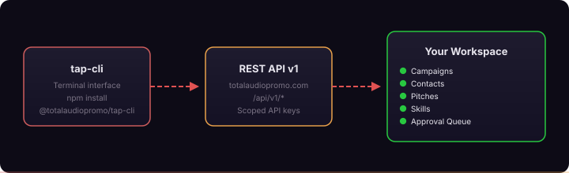

<p align="center">
  <a href="https://totalaudiopromo.com">
    
  </a>
</p>

<h1 align="center">tap-cli</h1>

<p align="center">
  <b>Terminal interface for <a href="https://totalaudiopromo.com">Total Audio Platform</a></b>
  <br>
  Manage campaigns, contacts, and pitches without leaving the command line.
</p>

<p align="center">
  <a href="https://www.npmjs.com/package/@totalaudiopromo/tap-cli">
    
  </a>
  <a href="https://www.npmjs.com/package/@totalaudiopromo/tap-cli">
    
  </a>
  <a href="LICENSE">
    
  </a>
  <a href="https://nodejs.org">
    
  </a>
  
</p>

<br>

<p align="center">
  
</p>

<br>

---

## Table of Contents

- [Features](#features)
- [Install](#install)
- [Quick start](#quick-start)
- [Architecture](#architecture)
- [Commands](#commands)
- [Global flags](#global-flags)
- [Configuration](#configuration)
- [Requirements](#requirements)
- [Sibling tools](#sibling-tools)
- [License](#license)

---

## Features

| | Feature | Description |
|---|---|---|
| 🚀 | **Campaign management** | Create, list, filter, and update campaigns from the terminal |
| 👤 | **Contact management** | Search, add, enrich, and import contacts with deduplication |
| ✍️ | **AI pitch drafting** | Generate three pitch variants (Direct, Story, Value) per contact |
| 📬 | **Send via Gmail** | Drafted pitches go through your connected Gmail — with daily send caps |
| 📊 | **Workspace stats** | Quick overview of campaign health, contact warmth, and queue status |
| 🔍 | **Contact discovery** | Find radio and press contacts via Perplexity, deduplicated against your workspace |
| 👀 | **Live monitor** | Poll your workspace every 30s and render a compact live dashboard |
| 📋 | **Approval queue** | See what needs you today: follow-ups, unpitched contacts, pending sends |
| 🧠 | **Skills** | List, run, fork, and inspect workspace skills from the terminal |
| 🔐 | **Scoped keys** | Same `tap_ak_*` keys as the REST API and MCP server |

---

## Install

```bash
npm install -g @totalaudiopromo/tap-cli
# or
pnpm add -g @totalaudiopromo/tap-cli
```

The binary is `tap`. Run `tap --version` to confirm it installed.

---

## Quick start

```bash
# Authenticate with your API key
tap auth login

# Open interactive mode
tap

# Or run commands directly
tap campaigns list --status active
tap stats
tap queue
```

Interactive mode presents a menu-driven interface for all commands — useful when you don't know a specific ID or want to browse before acting.

---

## Architecture

<p align="center">
  
</p>

`tap-cli` proxies every call through `https://totalaudiopromo.com/api/v1/*`. Your scoped API key is the only credential you need — no Supabase keys, no direct database access. The same key works with the [MCP server](https://www.npmjs.com/package/@totalaudiopromo/tap-mcp) and the REST API.

---

## Commands

### `tap` — interactive mode

Run `tap` with no arguments to open the interactive menu. Navigate campaigns and contacts, generate pitches, log outcomes, and run any command without needing to know IDs up front.

```bash
tap
```

---

### `tap auth` — authentication

```bash
tap auth login              # default flow — asks for a tap_ak_* key
tap auth status             # show current auth mode + scopes
```

Credentials are stored at `~/.tap/config.json` (chmod 600). The CLI proxies every call through the TAP REST API — no Supabase credentials touch your machine.

---

### `tap campaigns` — manage campaigns

```bash
tap campaigns list                                        # list all campaigns
tap campaigns list --status active                        # filter by status
tap campaigns list --json                                 # JSON output

tap campaigns show <id>                                   # campaign detail with health metrics, funnel, coverage
tap campaigns show <id> --json

tap campaigns create -n "Q2 Radio Push" -a "Artist Name"
tap campaigns create -n "Release" -a "Artist" -r "EP Title" -d 2026-04-01 -c radio,press

tap campaigns status <id> active                          # change status
tap campaigns status <id> completed
```

**Status values:** `draft`, `active`, `paused`, `completed`, `archived`

**`campaigns create` flags:**

| Flag | Description |
|------|-------------|
| `-n, --name` | Campaign name (required) |
| `-a, --artist` | Artist name |
| `-r, --release` | Release name |
| `-d, --date` | Release date (YYYY-MM-DD) |
| `-c, --channels` | Channels, comma-separated: `radio,press,playlist` |

---

### `tap contacts` — manage contacts

```bash
tap contacts list                              # list contacts (50 per page)
tap contacts list --warm                       # warm and hot contacts only
tap contacts list --bbc                        # BBC contacts only
tap contacts list --genre "Indie"              # filter by genre
tap contacts list --sort warmth                # sort by warmth score
tap contacts list --sort response              # sort by response rate
tap contacts list --sort last-contacted
tap contacts list -l 20 --page 2              # paginate
tap contacts list --json

tap contacts show <id-or-email>               # full contact detail: relationship metrics, campaigns, intelligence
tap contacts show <id-or-email> --json

tap contacts history <id-or-email>            # cross-campaign timeline
tap contacts history <id-or-email> -l 100     # up to 100 events

tap contacts search "Radio 1"                 # search by name, email, outlet, or BBC station
tap contacts search "Radio 1" --json

tap contacts add -n "Name" -e "email@outlet.com"
tap contacts add -n "Name" -e "email@outlet.com" -o "BBC Radio 6 Music" -r presenter -g "Indie,Alternative" -p radio --bbc-station "BBC Radio 6 Music"

tap contacts enrich <id>                      # queue contact for AI enrichment
```

**`contacts list` flags:**

| Flag | Description |
|------|-------------|
| `-s, --status` | Pipeline status filter |
| `-g, --genre` | Genre filter |
| `--bbc` | BBC contacts only |
| `--warm` | Warm and hot contacts only |
| `--sort` | Sort by: `name`, `warmth`, `response`, `last-contacted` |
| `-l, --limit` | Results per page (default: 50) |
| `-p, --page` | Page number (default: 1) |

**`contacts add` flags:**

| Flag | Description |
|------|-------------|
| `-n, --name` | Contact name (required) |
| `-e, --email` | Email address (required) |
| `-o, --outlet` | Outlet, publication, or station |
| `-r, --role` | Role: `presenter`, `producer`, `journalist`, `playlist_curator` |
| `-g, --genre` | Genres, comma-separated |
| `-p, --platform` | Platform type: `radio`, `press`, `playlist`, `podcast`, `blog` |
| `-b, --bbc-station` | BBC station name |

---

### `tap pitch` — generate AI pitch drafts

Generates three pitch variants (Direct, Story, Value) tailored to the contact's enrichment data, relationship history, and your campaign brief. Requires `ANTHROPIC_API_KEY`.

```bash
tap pitch <campaign-id>                                  # interactive contact selection
tap pitch <campaign-id> <contact-id>                     # specific contact
tap pitch <campaign-id> <contact-id> --hook "BBC 6 Music session artist"
tap pitch <campaign-id> <contact-id> --tone casual
tap pitch <campaign-id> --dry-run                        # show gathered context without generating
tap pitch <campaign-id> <contact-id> --json
```

**Flags:**

| Flag | Description |
|------|-------------|
| `--hook` | Key hook for the pitch — what makes this release special |
| `--tone` | Tone: `professional` (default), `casual`, `enthusiastic` |
| `--dry-run` | Print the gathered context without calling the AI |

If `--hook` is omitted, you'll be prompted interactively.

---

### `tap send` — send a pitch via Gmail

Sends a draft pitch through your connected Gmail account. Checks relationship warnings (cooling off, recent declines, over-pitching) before sending. Requires a Gmail connection in TAP settings.

```bash
tap send <pitch-id>
tap send <pitch-id> --dry-run     # preview without sending
tap send <pitch-id> --confirm     # skip confirmation prompt
tap send <pitch-id> --json
```

Daily send cap: 50 emails. Status and timestamps are written back to the pitch and campaign contact records automatically.

---

### `tap outcome` — log a campaign outcome

```bash
tap outcome <campaign-id> <contact-id> replied
tap outcome <campaign-id> <contact-id> played --channel radio
tap outcome <campaign-id> <contact-id> replied --notes "Loved it, wants exclusive"
tap outcome <campaign-id> <contact-id> declined --dry-run
```

**Outcome types:** `pitched`, `opened`, `replied`, `interested`, `played`, `covered`, `added`, `declined`, `passed`, `bounced`, `no_response`, `called`, `follow_up_scheduled`

**Flags:**

| Flag | Description |
|------|-------------|
| `-n, --notes` | Notes about the outcome |
| `-c, --channel` | Channel: `radio`, `press`, `playlist`, `sync` |
| `--dry-run` | Preview the status changes without saving |

Logging an outcome updates the contact's pitch status and pipeline status automatically.

---

### `tap skill` — workspace skill management

Power-user terminal entry point for the same skill set Claude Code agents drive via the MCP server's `tap_list_skills` / `tap_get_skill` / `tap_run_skill` / `tap_fork_skill` / `tap_get_invocation` tools.

```bash
tap skill list                          # every skill visible to this workspace
tap skill list --json                   # JSON output

tap skill view draft-pitches            # manifest + resolved body
tap skill view radio-outreach --body-only

tap skill run fact-check --input '{"campaign_id":"abc"}'
tap skill run draft-pitches --input-file ./inputs/pitches.json
tap skill run voice-check --input '{...}' --json

tap skill edit draft-pitches            # opens $EDITOR on the body, saves as workspace fork
tap skill reset draft-pitches           # drops the workspace fork, restores TAP default

tap skill invocation <invocation-id>    # audit row inspector
```

`tap skill` is REST-only. It does not fall through to any legacy path.

---

### `tap queue` — daily action queue

Shows what needs attention today: follow-ups due, unpitched contacts in active campaigns, unenriched contacts.

```bash
tap queue
tap queue --json
```

---

### `tap stats` — workspace metrics

High-level overview of your workspace: total contacts, active campaigns, pitches sent, outcomes logged.

```bash
tap stats
tap stats --json
```

---

### `tap discover` — AI-powered contact discovery

Uses Perplexity to find radio and press contacts matching your search. Deduplicates against existing contacts before importing. Requires `PERPLEXITY_API_KEY`.

```bash
tap discover "BBC Radio 6 Music"
tap discover --station "Kiss FM" --genre dance
tap discover --genre electronic --region london
tap discover "BBC Radio 6 Music" --import --enrich    # import all and queue for enrichment
tap discover "BBC Radio 6 Music" --limit 20 --json
```

**Flags:**

| Flag | Description |
|------|-------------|
| `--genre` | Filter by genre |
| `--region` | Filter by region |
| `--station` | Specific station lookup |
| `--import` | Auto-import all without prompting |
| `--enrich` | Queue imported contacts for AI enrichment |
| `-l, --limit` | Max results (default: 10) |

---

### `tap import` — import contacts from file or stdin

Accepts CSV, JSON, JSONL, or sink-cli output. Deduplicates against existing contacts before inserting.

```bash
tap import contacts.csv
tap import enriched.json
tap import contacts.csv --campaign <campaign-id>    # also add to a campaign
tap import contacts.csv --enrich                    # queue unenriched contacts for enrichment
tap import contacts.csv --dry-run                  # preview without importing
tap import contacts.csv --yes                      # skip confirmation

# pipe from sink-cli
sink wash contacts.csv --json | tap import --stdin
```

**Flags:**

| Flag | Description |
|------|-------------|
| `--stdin` | Read from stdin (for piping from sink-cli) |
| `--yes` | Skip confirmation prompt |
| `--dry-run` | Preview parse and deduplication without importing |
| `--campaign` | Add imported contacts to this campaign ID |
| `--enrich` | Queue unenriched contacts for AI enrichment |

---

### `tap watch` — live campaign monitor

Polls your workspace every 30 seconds and renders a compact live dashboard. Press `r` to refresh manually, `Ctrl+C` to exit.

```bash
tap watch                           # workspace overview (all active campaigns)
tap watch <campaign-id>             # focused view for one campaign
tap watch --interval 60             # poll every 60 seconds (minimum: 10)
tap watch --no-clear                # log mode — append instead of redrawing
```

Campaign focus mode shows pitch funnel, recent activity from the last 2 hours, and coverage clips. Workspace mode shows all active campaigns with pitch and reply rates, plus the action queue summary.

---

### `tap open` — open TAP in the browser

Resolves an ID to the correct TAP page (contact or campaign) and opens it in your default browser. Supports truncated IDs.

```bash
tap open                    # open TAP home
tap open <id>               # auto-detect and open contact or campaign page
tap open <id> --url         # print URL only, do not open browser
```

---

## Global flags

All commands accept these flags:

| Flag | Description |
|------|-------------|
| `-w, --workspace <id>` | Target a specific workspace ID |
| `--json` | Output as JSON (most commands) |
| `-v, --version` | Print version |

---

## Configuration

Credentials are stored at `~/.tap/config.json` (automatically created by `tap auth login`):

```json
{
  "apiKey": "tap_ak_live_...",
  "apiUrl": "https://totalaudiopromo.com/api/v1",
  "workspaceId": "ws_..."
}
```

Environment variables override config file values:

| Variable | Description |
|----------|-------------|
| `TAP_API_KEY` | Your scoped API key (overrides config) |
| `TAP_API_URL` | API base URL (default: `https://totalaudiopromo.com/api/v1`) |
| `TAP_WORKSPACE_ID` | Default workspace ID |
| `ANTHROPIC_API_KEY` | Required for `tap pitch` |
| `PERPLEXITY_API_KEY` | Required for `tap discover` |

---

## Requirements

- **Node.js 20** or later
- A **TAP account** with a release pack (get one at [totalaudiopromo.com](https://totalaudiopromo.com))
- A **scoped API key** from Settings → API Keys inside your workspace
- `ANTHROPIC_API_KEY` for AI pitch generation (`tap pitch`)
- `PERPLEXITY_API_KEY` for contact discovery (`tap discover`)
- **Gmail connected** in TAP settings for sending (`tap send`)

---

## Sibling tools

| Tool | Description |
|------|-------------|
| [**MCP server**](https://www.npmjs.com/package/@totalaudiopromo/tap-mcp) | `npx -y @totalaudiopromo/tap-mcp@latest` — same `tap_ak_*` key, same REST proxying. Use this for Claude Code / Cursor / Hermes integrations. |
| [**sink-cli**](https://github.com/totalaudiopromo/sink-cli) | Contact discovery + signals layer. The vision: `sink discover ... | sink signals ... | tap import` as one pipeline. |

---

## License

MIT — see [LICENSE](LICENSE).

---

<p align="center">
  <a href="https://totalaudiopromo.com">totalaudiopromo.com</a> ·
  <a href="https://github.com/chrisschouk/tap-cli">GitHub</a> ·
  <a href="https://www.npmjs.com/package/@totalaudiopromo/tap-cli">npm</a>
</p>